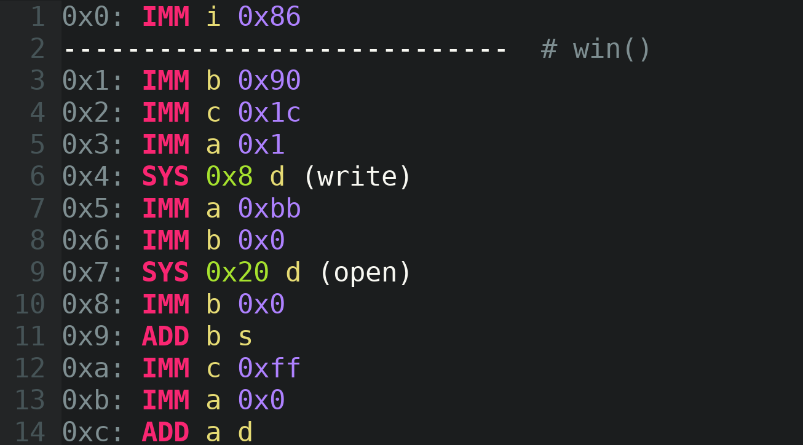

# Vim Yan85 Syntax

_Syntax highlighting for your everyday Yan85 assembly programming and reversing needs._




Vim colorization for Yan85 assembly, the obscure language you may know from [Pwn College](https://pwn.college/).

## Installation

Copy `yan85.vim` into `~/.vim/syntax/` and optionally add the following to `~/.vimrc`:

```
au BufNewFile,BufReadPost *.yan  set filetype=yan85
```

## Syntax

The syntax is based on the output from the Baby Reverse Engineering challenges, but with `*` and `=` characters optional.
Some additions have been made for line numbers and comments.

## Reference

For help editing or creating your own syntax file, see: https://vim.fandom.com/wiki/Creating_your_own_syntax_files
